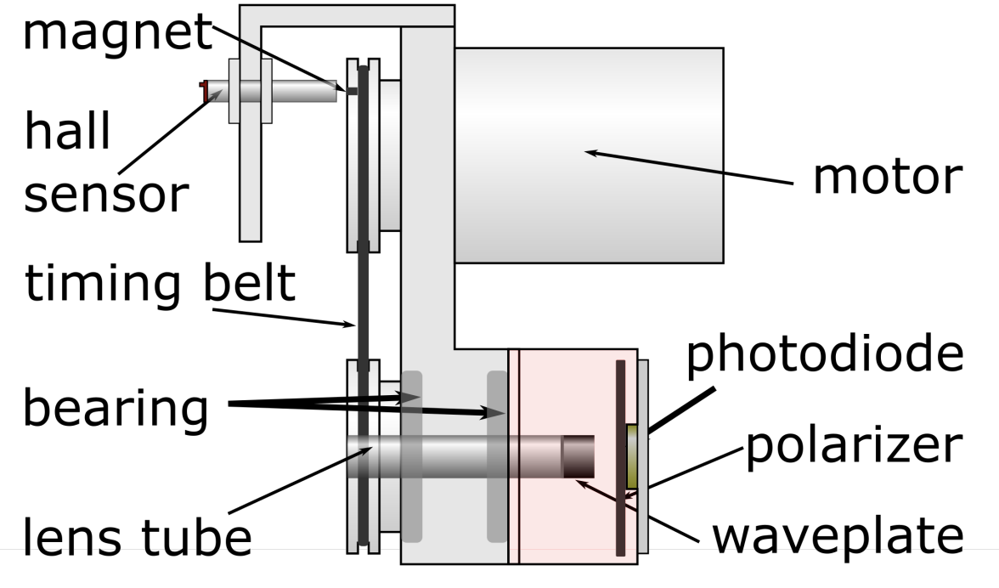

## Spinning Waveplate Polarimeter

*Using a rotating quarter-waveplate, a photodiode, and a few Python scripts, we are able to produce real-time visualization of the polarization state of incident light. This fully intergrated system is easily calibrated and an affordable alternative to other fussy optical technologies making it ideal for reasearch laboratories and educational environments.*

# Real-time Detection of Polarization of Incident Light

Initially, we use the API provided by the DAQ hat to acquire a fixed number of samples for processing; typically this is 1000 samples at 20 ksps when the waveplate is spinning between 4500 to 5500 RPM. The raw data input is then divided into segments. Each segment is numerically integrated to determine the Fourier coefficients, and furthermore, the Stokes parameters and polarzation state. To minimize any statistical errors, the mean result over several segments is considered and the display is refreshed at a rate of 4 Hz.

The reconstruction of the Stokes vector is achieved by calculating the incident intensity upon the rotating waveplate as a function of the rotation angle when aligned horizontally. We make the assumption that the waveplate has some arbitrary retardance instead of considering a precisely calibrated quarter-waveplate. Lastly, using the orthogonality of trigonometric functions we are able to extract the Stokes parameters S0, S1, S2 and S3. Using the Stokes parameters, the degree of polarization of the incident light is also obtained through a trivial calculation.

Please see our more rigourous [explanation](https://arxiv.org/pdf/2102.06114.pdf) and [analysis](https://github.com/UVicAMOlab/swp-polarimeter/blob/main/docs/analysis/polarimeter_analysis.pdf) for more details.

# Information Obtained from Polarimeter

The continuous data input through the Raspberry Pi's MCC DAQ hat along with the included software allows for the real-time determination and visualization of several polarization parameters. These include:

- Polarization ellipse/type of polarization (2D or 3D avaliable)
- Stokes parameters as bar graph
- Degree of polarization
- Mean input signal over several segments of data
- Waveform incident on photodiode

# Apparatus Diagram

# Operation Instructions
-- example step by step process of running device and code from the ground up.
- how to interpret UI
- warnings?
- alignment?

# Optional Features?
- 3D representation of polarization?

# Manufacturing Process
--- PHYSICAL APPARATUS
    - body
    - motor
    - pcb shell

--- PCB
    - printing

--- CODE INSTALLATION
    - cloning repository or downloading zip file
    - running python script

# Calibration Instructions
- waveplate retardance
- trigger delay

# Known Limitations
- how accurate is the polarimeter (say it again)

